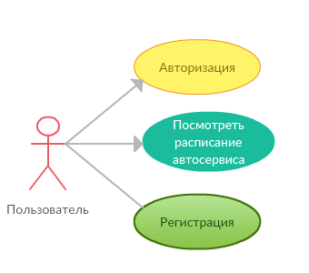



	<h3 align="center"> Федеральное агентство по образованию РФ ГОУ </h3>
	<h3 align="center">ВПО Нижегородский государственный университет им. Н.И. Лобачевского</h3>
	<h3 align="center">Факультет Вычислительной математики и кибернетики Кафедра Математического обеспечения ЭВМ </h3>
 
 
 
 
 
 
 
 
 
 
	<h3 align="center"> УЧЕБНЫЙ КУРС </h3>
	<h4 align="center">«Объектно-ориентированный анализ и проектирование» для подготовки по направлению «Информационные технологии»</h4>
	<h3 align="center"> КОНЦЕПЦИЯ ПРОЕКТА </h3>
&nbsp;
 
 
 
 
 
 
 
 
 
 
 
 
 
 

Нижний Новгород 2018

#
### Содержание
1. __Необходимость проекта__
	
	1. __Обоснование необходимости__
	1. __Видение проекта__
	1. __Анализ выгод__
2. __Концепция решения__
	
	2. __Цели и Задачи__
	2. __Предположения и Ограничения__
	2. __Анализ использования__
	
		2. __Пользователи__
		2. __Сценарии использования__
	2. __Требования__
	
		2. __Требования пользователей__
		2. __Системные требования__
3. __Рамки__

	3. __Функциональность решения__
	3. __За рамками решения__
	3. __Критерии одобрения решения__
4. __Стратегии дизайна решения__

	4. __Стратегия архитектурного дизайна__
	4. __Стратегия технологического дизайна__

#
<!--
Итеративный подход к процессу разработки требует использования гибкого способа ведения документации. Живые документы (living documents) должны изменяться по мере эволюции проекта. Такой подход существенно отличается от принципов ведения документации в известной каскадной модели, где процесс разработки начинается лишь после того, как готовы и зафиксированы все требования и спецификации.
Документация проектов, также как и программный код, разрабатывается итеративно. На фазе выработки концепции планы имеют форму описания высокоуровневых подходов (approaches) и по мере подготовки распространяются среди членов проектной группы и других заинтересованных лиц для получения отзывов. К примеру, подход к тестированию может быть кратко сформулирован во время фазы выработки концепции, а его превращение в план тестирования происходит на более поздних фазах. После перехода к фазе планирования документы постепенно дорабатываются, возникающие детальные планы снова поступают на проверку всем заинтересованным сторонам, и описанный процесс повторяется итеративно. Типы планов и общее количество описывающих их документов могут варьироваться от проекта к проекту.
-->

## 1. Необходимость проекта
### 1.1	Обоснование необходимости
<!--
Выгода сервиса от создания приложения
(Кустикова)
-->
 - Необходимость личной связи между клиентом и менеджером для записи на обслуживание.
 - Неудобство оповещения клиентов об изменении статуса работ через телефон.
 - Дополнительная занятость менеджера общением с клиентами.
 - Отсутствие общего расписания занятости автосервиса.(

### 1.2.	Видение проекта
<!--
Видение (vision) – это ничем не ограничиваемое представление о том, каким должно быть решение (solution). Видение проекта направлено на формирование у всех вовлеченных в проект сторон единого понимания его концепции. Формулировка видения (vision statement) должна быть достаточно краткой для запоминания, достаточно ясной для понимания и достаточно сильной для мотивирования. Хорошая формулировка видения ориентируется на пять SMART характеристик:
- Specific (определенность/конкретность) – видение четко указывает на то (идеальное) состояние, достижение которого является целью проекта.
-Measurable (измеримость) – дает проектной группе четкий критерий успешности проекта и достижения поставленных целей.
- Achievable (достижимость) – цели, сформулированные в видении, должны быть достижимы в рамках имеющихся ресурсов, времени и возможностей команды. Достижимость мотивирует команду на выполнение проекта.
- Relevant (обоснованность) – цели, сформулированные в видении, должны иметь существенное значение для заинтересованных сторон и напрямую быть связанными с их проблемами и/или потребностями.
- Time-based (ограниченность во времени) – видение должно четко указывать на ожидаемые временные рамки, в которые решение будет достигнуто. -->
<!--Явно описать каждый пункт!!!! (Кустикова)
-->
Необходимо до конца семестра написать программный комплекс, с помощью которого клиенты смогут записать машину на ремонт в автосервис и отслеживать статус работ, а менеджеры автосервиса смогут управлять расписанием ремонтов, корректировать его, контактировать с клиентом и обновлять статус ремонта.

### 1.3.	Анализ выгод
<!--
Например: Отсутствие накладок в расписании
Дополнить
(Кустикова)
 -->
Заказчик получит удобное решение, позволяющее более эффективно организовывать работу автосервиса и предоставлять клиентам удобный интерфейс взаимодействия, а именно:
- Получать заказы от клиентов автоматически (без личного общения)
- Быстро и удобно редактировать расписание занятости
- Предоставлять клиентам удобочитаемую информацию о статусе работ
- Общаться с клиентом в режиме чата (?)
- Отслеживать количество заказов, средний чек, оценивать производительность(?)

## 2 Концепция решения
<!--
Концепция решения (solution concept) предоставляет общее описание подходов, которые проектная группа предполагает использовать для разрешения проблем и/или удовлетворения потребностей заинтересованных сторон.
-->

### 2.1. Цели и Задачи
Цель работы:
#### Сделать для клиентов автосервиса упрощенную онлайн запись на диагностику автомобиля:
* Система должна отображать список свободных часов для записи к мастеру.
* Для записи к специалисту клиент должен выбрать свободное и удобное ему время и подтвердить выбор.
#### Обеспечить клиентам возможность просматривать ход работы онлайн :
* Сервис должен отображать клиенту текущее состояние работы с его автомобилем.
* По любому вопросу клиент сможет обратиться к определённому менеджеру, для уточнения деталей.
#### Обеспечить рабочему персоналу упрощенную работу с заказами :
* Менеджер будет иметь доступ ко всем заказам, закреплённым за ним.
* Менеджер будет иметь возможность изменить время работы над конкретным заказом на любое другое, свободное время.
* Менеджер сможет в любой момент связаться с клиентом для уточнения деталей работы.
* Администратор будет иметь доступ ко всем заказам в автосервисе, менять их статус и время.
* Администратор сможет менять менеджера для определённого заказа на других доступных менеджеров.
* Администратор будет иметь доступ ко всем пользователям зарегистрированным в сервисе 
* Администратор будет иметь возможность присваивать аккаунту пользователя статус Менеджер и убирать этот статус
#### Оптимизировать работу сервиса, сократить затраты на обслуживание заказов :
* Разработка данной системы позволит автоматизировать запись и управление заказами.
* Разработка данной системы позволит уменьшить затраты на персонал, занимающийся связью с клиентами.
<!--
Формирование концепции решения начинается с выяснения у заинтересованных сторон, описания и фиксации проектной группой целей проекта. Далее каждая цель разбивается на измеримые компоненты – задачи.
-->
<!--
Цель – разработать
Чтобы разработать нужно решить следующие задачи ...
(Кустикова)
-->

### 2.2. Предположения и Ограничения
<!--
В процессе формирования концепции решения проектная группа постоянно взаимодействует с заинтересованными сторонами, собирая необходимую информацию о требованиях к функциональности будущего решения. Тем не менее, неизбежная неполнота информации приводит к тому, что относительно некоторых функциональных возможностей решения могут потребоваться предположения (assumptions). Помимо функциональных требований заинтересованные стороны могут выдвигать качественные требования, задающие ограничения на создаваемое решение. Также ограничения могут порождаться средой, в которой должно будет функционировать решение после внедрения.
-->
<!--
Поставить себя на место пользователя и посмотреть что мы будем реализовывать, а что не будем (кроссплатформенность) добавить больше
(Кустикова)
-->
#### Предположения:
- Возможность взаимодействия с клиентом через чат
- Равномерное распределение клиентов по менеджерам
- Простой, интуитивный интерфейс, позволяющий начать работу с системой без специального обучения, а также будет удобен клиентам

#### Ограничения:
- Система позволит выбрать дату и время только на две недели вперёд.
- Система будет хранить историю работы не более двух недель для каждого заказа, более старые записи будут удаляться
- У одного клиента может быть только один автомобиль
- Система будет разработанна только для ОС Windows
- У системы предусмотрен лишь один аккаунт администратора

### 2.3.	Анализ использования
<!--
Основой формулировки требований является анализ использования, включающий определение пользователей (users) и описание того, как пользователи будут взаимодействовать с решением.
-->

#### 2.3.1.	Пользователи
<!--
В разработке решения заинтересованы множество сторон, однако непосредственная работа с ним будет выполняться пользователями, поэтому прежде чем приступать к дизайну решения, необходимо определить, кто будет с ним взаимодействовать. В процессе анализа должны быть выделены группы пользователей (например, на основе областей их деятельности, в которых будет использоваться разрабатываемое решение).
-->
<!--
Менеджеры должны так же иметь функционал клиента автосалона (иметь возможность записаться на ремонт)
-->
- Неавторизированный пользователь
- Клиенты автосалона
- Менеджеры автосалона
- Администратор

#### 2.3.2.	Сценарии использования
<!--
Сценарии использования (usage scenarios) определяют последовательности действий, которые пользователи выполняют при взаимодействии с решением. Один из возможных (и достаточно распространенных) вариантов – язык UML.
Для каждой выделенной на предыдущем шаге группы пользователей определите характерные способы их взаимодействия с решением и, используя необходимые диаграммы UML, опишите сценарии использования.
-->
##### Неавторизированный пользователь:

##### Клиент:

##### Менеджер:

##### Администратор:

<!-- Добавить возможность просматривать список всех пользователей -->
### 2.4.	Требования
<!--
Требования (requirements) определяют, что должно делать разрабатываемое решение. Требования могут выражаться в терминах функциональности или в виде правил и параметров, определяющих функциональность. -->

#### 2.4.1.	Требования пользователей
##### Общее. 
- Сервис должен позволять пользователям использовать функционал, представленный в разделе 2.3.2 «Сценарии использования».
- Аутентификация и роли пользователей в системе. Пользователи сервиса имеют возможность регистрироваться и проходить аутентификацию в системе. Система предусматривает наличие трёх ролей для авторизации: роль клиента, роль менеджера и роль администратора.
- Процедура регистрации. При регистрации пользователь должен предоставить о себе данные в виде фамилии, имени, отчества, адреса электронной почты и номера контактного телефона. Также указывается пароль, который в дальнейшем будет использоваться для входа в систему.
- Процедура аутентификации. Аутентификация в системе осуществляется путём запроса адреса электронной почты и пароля пользователя и их проверки на совпадение и корректность.
##### Главная страница
- После прохождения процедуры авторизации пользователь попадает на главное окно, отображающее текущее расписание автосалона. В верхней части страницы имеется панель с возможностью перейти к отслеживанию работы над своим автомобилем.
- На главном окне будет отображен календарь начиная с текущего момента времени на две недели вперёд. На нём будут показаны свободные и занятые ячейки работы мастеров.
- При выделении свободной ячейки, кнопка "Запись" станет доступна для клиента.
- При нажатии на панели на "Мой автомобиль" будет окрыто окно в котором будет отображаться текущий статус работы над автомобилем и кнопка для связи с менеджером.

##### Система  для менеджера
- Интерфейс системы для менеджера будет такой же, как для обычного пользователя, но с добавлением новых возможностей.
- В панеле сверху будет добавлена функция "Мои клиенты". При нажатии будут отображены все заказы клиентов для данного менеджера.
###### Мои клиенты
- При нажатии на любой заказ, отображается текущий статус заказа.
- Для каждого заказа будет реализованна возможность изменения статуса заказа
- Для каждого заказа будет реализованна возможность изменения времени обслуживания
- При изменении времени будет открыта календарь с главной страницы, на нём будут отображено возможное время переноса.

##### Система для администратора
- Главная страница будет идентична предыдущим двум.
- В верхней панели будет возможность открыть все заказы автосервиса, аналогично "Мои клиенты" для менеджера.
- Помимо функционала менеджера будет добавлена возможность сменить менеджера для конкретного клиента.
- В верхней панели появится возможность просмотра списка всех пользователей
- Любому клиенту возможно будет присвоить статус менеджер
- Отдельно появится возможность просмотреть список менеджеров
- У любого менеджера можно будет забрать права менеджера

<!--
Сформулируйте требования к решению с точки зрения пользователей.
-->

#### 2.4.2.	Системные требования
##### Функциональные:

<!--
Для каждой функциональной задачи необходимо прописать
ID
Принадлежность к группе
Описание
Приоритет
Риск
Связанные задачи
-->

<!--
Клиент
-->
| ID          | F001   |
|-------------|---|
| Group       | Регистрация  |
| Description | Регистрация нового пользователя в сети. Пользователь должен будет ввести email и пароль для новой учетной записи. |
| Priority    | 1  |
| Source      | Техническое задание |
| Risk        | 1  |
| Referense   | E001, E002, E003 |

| ID          | F002  |
|-------------|---|
| Group       | Общие возможности. Авторизация  |
| Description | Авторизация зарегистрированного пользователя в системе  |
| Priority    | 1  |
| Source      | Техническое задание |
| Risk        | 1  |
| Referense   | E004  |

| ID          | F003  |
|-------------|---|
| Group       | Общие возможности  |
| Description | Отображение текущей занятости мастеров и свободного времени работы |
| Priority    | 1  |
| Source      | Техническое задание |
| Risk        | 1  |
| Referense   | E005, E009  |

| ID          | F004  |
|-------------|---|
| Group       | Общие возможности  |
| Description | Запись на диагностику на определённое время                                                                            |
| Priority    | 1  |
| Source      | Техническое задание |
| Risk        | 1  |
| Referense   | E006, E007, E008, E009  |

| ID          | F005  |
|-------------|---|
| Group       | Общие возможности  |
| Description | Открыть чат для связи с менеджером, отвечающим за работу с автомобилем клиента   |
| Priority    | 1  |
| Source      | Техническое задание |
| Risk        | 1  |
| Referense   | E007, E008, E009  |

| ID          | F006  |
|-------------|---|
| Group       | Общие возможности  |
| Description | Открыть свой заказ, чтобы посмотреть текущий статус работы |
| Priority    | 1  |
| Source      | Техническое задание |
| Risk        | 1  |
| Referense   | E007, E008, E009  |

| ID          | F007  |
|-------------|---|
| Group       | Общие возможности  |
| Description | Выход из своей учетной записи. После выхода клиент идентифицируется в системе, как неавторизованный |
| Priority    | 1  |
| Source      | Техническое задание |
| Risk        | 1  |
| Referense   | E007, E008  |

<!--
Менеджер
-->
Менеджмент:

| ID          | F008  |
|-------------|---|
| Group       | Менеджмент клиентов  |
| Description | Открыть список модерируемых клиентов  |
| Priority    | 1  |
| Source      | Техническое задание |
| Risk        | 1  |
| Referense   | E007, E008, E009  |

| ID          | F009  |
|-------------|---|
| Group       | Менеджмент клиентов  |
| Description | Перенос диагностики для автомобиля конкретного клиента на другое время |
| Priority    | 1  |
| Source      | Техническое задание |
| Risk        | 1  |
| Referense   | E006, E007, E008, E009  |

| ID          | F010  |
|-------------|---|
| Group       | Менеджмент клиентов  |
| Description | Изменение статуса работы над автомобилем определённого клиента  |
| Priority    | 1  |
| Source      | Техническое задание |
| Risk        | 1  |
| Referense   | E007, E008, E009  |

<!--
Админ
-->

Администрирование:

| ID          | F011  |
|-------------|---|
| Group       | Администрирование персонала |
| Description | Открыть полный список всех текущих работ в сервисе   |
| Priority    | 1  |
| Source      | Техническое задание |
| Risk        | 1  |
| Referense   | E007, E009  |

| ID          | F012  |
|-------------|---|
| Group       | Администрирование персонала |
| Description | Сменить текущего менеджера для клиента, на другого, работающего в автосервисе   |
| Priority    | 1  |
| Source      | Техническое задание |
| Risk        | 1  |
| Referense   | E007, E009  | 

| ID          | F013  |
|-------------|---|
| Group       | Администрирование персонала |
| Description | Показать список всех менеджеров автосервиса   |
| Priority    | 1  |
| Source      | Техническое задание |
| Risk        | 1  |
| Referense   | E007, E009, F015  | 

| ID          | F014  |
|-------------|---|
| Group       | Администрирование персонала |
| Description | Присвоение зарегистрированному пользователю статус Менеджера   |
| Priority    | 1  |
| Source      | Техническое задание |
| Risk        | 1  |
| Referense   | E007, E009, E010, F016 |

| ID          | F015  |
|-------------|---|
| Group       | Администрирование персонала |
| Description | Отменить у зарегистрированного пользователя статус Менеджера  |
| Priority    | 1  |
| Source      | Техническое задание |
| Risk        | 1  |
| Referense   | E007, E009, E011, F013, F016  |

| ID          | F016  |
|-------------|---|
| Group       | Администрирование персонала  |
| Description | Отображение списка всех зарегистрированных пользователей. Данная функция отобразит все аккаунты зарегистрированные в системе  |
| Priority    | 1  |
| Source      | Техническое задание |
| Risk        | 1  |
| Referense   | E012, F014, F015 |

##### Требования надёжности

| ID          | E001  |
|-------------|---|
| Group       | Регистрация |
| Description | При регистрации на уже регистрированный email должна появится ошибка, что данный email уже зарегистрирован  |
| Priority    | 1  |
| Source      | Техническое задание |
| Risk        | 1  |
| Referense   | F001  | 

| ID          | E002  |
|-------------|---|
| Group       | Регистрация |
| Description | Проверка введённого пользователем email на  правильность . Email имеет стандартный вид: логин@доменное имя сервера |
| Priority    | 1  |
| Source      | Техническое задание |
| Risk        | 1  |
| Referense   | F001  | 

| ID          | E003  |
|-------------|---|
| Group       | Регистрация |
| Description | Если пароль пользователя меньше 6 символов, система должна будет попросить пользователя усложнить пароль |
| Priority    | 1  |
| Source      | Техническое задание |
| Risk        | 1  |
| Referense   | F001  | 

| ID          | E004  |
|-------------|---|
| Group       | Общие возможности. Авторизация |
| Description | При неверном email + пароль при авторизации, либо при неверном пароле, должна появляться ошибка "Неверный email+пароль" |
| Priority    | 1  |
| Source      | Техническое задание |
| Risk        | 1  |
| Referense   | F002  | 

| ID          | E005  |
|-------------|---|
| Group       | Общие возможности |
| Description | Корректное отображение текущего графика работы мастера |
| Priority    | 1  |
| Source      | Техническое задание |
| Risk        | 1  |
| Referense   | F003  | 

| ID          | E006  |
|-------------|---|
| Group       | Общие возможности |
| Description | При выборе для диагностики занятого времени, должна появляться ошибка и просьба выбрать другое время  |
| Priority    | 1  |
| Source      | Техническое задание |
| Risk        | 1  |
| Referense   | F004  | 

| ID          | E007  |
|-------------|---|
| Group       | Уровни доступа |
| Description | Неавторизированные пользователи не могут получить доступ к своим заказам и другим возможностям авторизированных пользователей. Для них должен отображаться лишь график работ и кнопка авторизации    |
| Priority    | 1  |
| Source      | Техническое задание |
| Risk        | 1  |
| Referense   | F004 - F015  |  <!-- ( Вот тут остаётся вопрос, необходимо ли это указывать? ) -->

| ID          | E008  |
|-------------|---|
| Group       | Уровни доступа |
| Description | Авторизированные пользователи с более низким уровнем доступа не могут использовать функционал более высоких уровней. Уровни доступа для данной системы Клиент < Менеджер < Администратор.   |
| Priority    | 1  |
| Source      | Техническое задание |
| Risk        | 1  |
| Referense   | F004 - F010  |  <!-- ( Вот тут остаётся вопрос, необходимо ли это указывать? ) -->

| ID          | E009  |
|-------------|---|
| Group       | Общие возможности |
| Description | При потери связи с Базой данных по каким-либо причинам, должно выводится сообщение о технических неполадках  |
| Priority    | 1  |
| Source      | Техническое задание |
| Risk        | 1  |
| Referense   | F003 - F006, F008 - F015 |

| ID          | E010  |
|-------------|---|
| Group       | Администрирование персонала |
| Description | При присвоении статуса Менеджер пользователю с этим статусом Менеджер, должно выводится сообщение о том, что данный пользователь уже имеет такой статус   |
| Priority    | 1  |
| Source      | Техническое задание |
| Risk        | 1  |
| Referense   | F014  |

| ID          | E011  |
|-------------|---|
| Group       | Администрирование персонала |
| Description | При анулировании статуса Менеджер у пользователя не являющегося Менеджером, должно выводится сообщение о том, что данный пользователь не имеет такой статус  |
| Priority    | 1  |
| Source      | Техническое задание |
| Risk        | 1  |
| Referense   | F015  |

| ID          | E012  |
|-------------|---|
| Group       | Администрирование персонала |
| Description | Корректное отображение всех зарегистрированных аккаунтов, при запросе  |
| Priority    | 1  |
| Source      | Техническое задание |
| Risk        | 1  |
| Referense   | F016  |

##### Требования производительности

| ID          | P001  |
|-------------|---|
| Group       | Производительность |
| Description | При стабильном соединении с интернетом и отсутствии нагрузки на сервер, время любой операции не должно превышать 5 секунд   |
| Priority    | 1  |
| Source      | Техническое задание |
| Risk        | 1  |
| Referense   | P002  |

| ID          | P002  |
|-------------|---|
| Group       | Производительность |
| Description | Система должна стабильно работать при подключении к ней до 8 пользователей одновременно   |
| Priority    | 1  |
| Source      | Техническое задание |
| Risk        | 1  |
| Referense   | P001  |

##### Требования удобства использования

| ID          | U001  |
|-------------|---|
| Group       | Удобство |
| Description | Интерфейс программы будет интуитивно понятен. Это значит, что для освоения данной программы обычному пользователю понадобится не более суток   |
| Priority    | 1  |
| Source      | Техническое задание |
| Risk        | 1  |
| Referense   |   |

| ID          | U002  |
|-------------|---|
| Group       | Удобство |
| Description | Возможность из любого окна переключится на любое другое окно. Соответсвтующие вкладки не должны менять свои местоположения   |
| Priority    | 1  |
| Source      | Техническое задание |
| Risk        | 1  |
| Referense   |   |

| ID          | U003  |
|-------------|---|
| Group       | Удобство |
| Description | Выход из системы, доступный авторизированным пользователям, будет располагаться вместо кнопки "Авторизация" |
| Priority    | 1  |
| Source      | Техническое задание |
| Risk        | 1  |
| Referense   |   |

<!--
Сформулируйте требования к решению с точки зрения среды, в которой оно должно будет функционировать после внедрения.
-->

## 3.	Рамки
<!--
Рамки (scope) определяют пространство параметров, в котором будет создаваться решение, детализируя функциональность, определяя, что останется за рамками решения и указывая критерии, по которым заинтересованные лица будут судить о готовности решения. Рамки создаются на основе единого видения, являются результатом компромисса между сформулированными целями и условиями реальности и отражают приоритезацию заказчиком имеющихся требований к создаваемому решению. Частью процесса определения рамок проекта является вынесение менее важной функциональности из текущего проекта в планы на будущее.
Рамки решения (solution scope) определяют функциональность решения и его возможности (включая те, что не относятся к программному обеспечению). Возможность (функциональность, составляющая, feature) – это требуемый или желаемый аспект программного или аппаратного обеспечения. Например, предварительный просмотр перед печатью может быть возможностью текстового процессора; шифрование почтовых сообщений – возможностью почтовой программы. Сопроводительные руководства пользователей, интерактивные файлы помощи, операционные руководства и обучение также могут быть составляющими решения.
Рамки проекта (project scope) определяют объем работ, который должен быть выполнен проектной группой для поставки заказчику каждого из элементов, определенного рамками решения.
Управление рамками проекта критично для его успеха. Необходимо определять и фиксировать рамки решения и проекта, используя треугольник компромиссов и матрицу компромиссов проекта.
-->

### 3.1.	Функциональность решения
<!--
Укажите здесь функциональность в терминах возможностей (features) и функций (functions), которая будет реализована в разрабатываемом решении.
-->

### 3.2.	За рамками решения
<!--
Укажите здесь функциональность, которая имеется или предполагается в требованиях заинтересованных сторон, но не будет реализована в решении, и опишите причины вынесения данных возможностей и функций за рамки решения (используйте треугольник компромиссов).
-->

### 3.3.	Критерии одобрения решения
<!--
Сформулируйте здесь критерии, в соответствии с которыми заинтересованные стороны будут принимать готовность решения.
-->

## 4.	Стратегии дизайна решения

### 4.1.	Стратегия архитектурного дизайна
<!--
На основе разработанного списка возможностей и функций формируется стратегия архитектурного дизайна (architectural design strategy), описывающая решение в целом. Она определяет компоненты решения и их взаимодействие. Отличный способ описания решения на этом этапе – использование иллюстрирующих диаграмм (например, UML).
Сформируйте и опишите общий архитектурный проект решения.
-->

### 4.2.	Стратегия технологического дизайна
<!--
Разработка решения потребует использования определенных продуктов и технологий. Стратегия технологического дизайна (technical design strategy) описывает, какие технологии и продукты выбраны проектной группой в качестве средства реализации решения.
Аргументировано опишите, какие технологические средства будут использованы в процессе работы над решением.
-->
