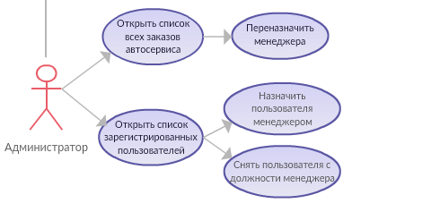

    <h3 align="center"> Федеральное агентство по образованию РФ ГОУ </h3>
    <h3 align="center">ВПО Нижегородский государственный университет им. Н.И. Лобачевского</h3>
    <h3 align="center">Факультет Вычислительной математики и кибернетики Кафедра Математического обеспечения ЭВМ </h3>
 
 
 
 
 
 
 
 
 
 
    <h3 align="center"> УЧЕБНЫЙ КУРС </h3>
    <h4 align="center">«Объектно-ориентированный анализ и проектирование» для подготовки по направлению «Информационные технологии»</h4>
    <h3 align="center"> КОНЦЕПЦИЯ ПРОЕКТА </h3>
 
 
 
 
 
 
 
 
 
 
 
 
 
 
    
Нижний Новгород 2018

#
### Содержание
1. __Необходимость проекта__

	1. __Обоснование необходимости__
	2. __Видение проекта__
	3. __Анализ выгод__
2. __Концепция решения__

	1. __Цели и Задачи__
	2. __Предположения и Ограничения__
	3. __Анализ использования__

		1. __Пользователи__
		2. __Сценарии использования__
	4. __Требования__

		1. __Требования пользователей__
		2. __Системные требования__
3. __Рамки__

	1. __Функциональность решения__
	2. __За рамками решения__
	3. __Критерии одобрения решения__
4. __Стратегии дизайна решения__

	1. __Стратегия архитектурного дизайна__
	2. __Стратегия технологического дизайна__

#
<!--
Итеративный подход к процессу разработки требует использования гибкого способа ведения документации. Живые документы (living documents) должны изменяться по мере эволюции проекта. Такой подход существенно отличается от принципов ведения документации в известной каскадной модели, где процесс разработки начинается лишь после того, как готовы и зафиксированы все требования и спецификации.
Документация проектов, также как и программный код, разрабатывается итеративно. На фазе выработки концепции планы имеют форму описания высокоуровневых подходов (approaches) и по мере подготовки распространяются среди членов проектной группы и других заинтересованных лиц для получения отзывов. К примеру, подход к тестированию может быть кратко сформулирован во время фазы выработки концепции, а его превращение в план тестирования происходит на более поздних фазах. После перехода к фазе планирования документы постепенно дорабатываются, возникающие детальные планы снова поступают на проверку всем заинтересованным сторонам, и описанный процесс повторяется итеративно. Типы планов и общее количество описывающих их документов могут варьироваться от проекта к проекту.
-->

## 1. Необходимость проекта
### 1.1	Обоснование необходимости
<!--

-->
Автосервис WillFixAll стремится к автоматизации системы предоставляемых услуг, что в конечном итоге позволит сократить расходы и увеличить производительность компании за счет автоматической записи на ремонт, повысить производительность и качество обслуживания клиентов.
Клиенты автосервиса WillFixAll будут иметь удобную возможность получать качетсвенные услуги по обслуживанию (ремонту или диагностике) автомобиля, такие как решение допольнительных вопросов, возникающих по ходу обслуживания автомобиля через чат. Процесс записи на ремонт будет занимать значительно меньше времени путем внедрения технологии онлайн записи.

### 1.2. Видение проекта
<!--
Видение (vision) – это ничем не ограничиваемое представление о том, каким должно быть решение (solution). Видение проекта направлено на формирование у всех вовлеченных в проект сторон единого понимания его концепции. Формулировка видения (vision statement) должна быть достаточно краткой для запоминания, достаточно ясной для понимания и достаточно сильной для мотивирования. Хорошая формулировка видения ориентируется на пять SMART характеристик:
- Specific (определенность/конкретность) – видение четко указывает на то (идеальное) состояние, достижение которого является целью проекта.
-Measurable (измеримость) – дает проектной группе четкий критерий успешности проекта и достижения поставленных целей.
- Achievable (достижимость) – цели, сформулированные в видении, должны быть достижимы в рамках имеющихся ресурсов, времени и возможностей команды. Достижимость мотивирует команду на выполнение проекта.
- Relevant (обоснованность) – цели, сформулированные в видении, должны иметь существенное значение для заинтересованных сторон и напрямую быть связанными с их проблемами и/или потребностями.
- Time-based (ограниченность во времени) – видение должно четко указывать на ожидаемые временные рамки, в которые решение будет достигнуто.
-->

Разрабатываемый программный комплекс позволит сделать сервис предоставления услуг автосервиса WillFixAll более комфортным и современным, упростив для клиентов организации процедуру записи на ремонт или диагностику, а также предоставив им возможность более быстро и в удобное им время решать вопросы, возникающие во время обслуживания автомобиля(покупка запчастей, дополнительные услуги, перенос процедуры ремонта или диагностики), а так же в режиме real-time узнавать статус ремонта или диагностики автомобиля.
Реализация решения займет не более трех месяцев.

### 1.3. Анализ выгод
<!--

-->

- Автосервис WillFixAll значительно повышает качество предоставляемых услуг, за счет чего получает более конкурентное преимущество на рынке автосервисов.
- Автоматизация системы записи автомобиля на обслуживание позволит автосервису сэкономить время менеджеров, в данный момент уходящее на запись клиентов лично и по телефону.
- Клиенты автосервиса будут иметь возможность быстрой и удобной записи на оказание любых услуг автосервиса из любой точки, в которой есть доступ к сети Интернет.
- Клиенты автосервиса получат возможность в удобное им время без траты време на устный ответ в режиме чата решать с менеджером вопросы, возникающие во время обслуживания автомобиля.
- Клиенты автосервиса получат возможность в любой момент узнать статус работ, совершаемых над их автомобилем.
- Менеджеры смогут удобнее планировать свой рабочий график, просматривая расписание и изменяя дату заказов на более удобное, в режиме онлайн.
- Данное решение устранит на программном уровне накладки в расписании и другие неприятные последствия воздействия человеческого фактора.

## 2 Концепция решения
<!--
Концепция решения (solution concept) предоставляет общее описание подходов, которые проектная группа предполагает использовать для разрешения проблем и/или удовлетворения потребностей заинтересованных сторон.
-->

### 2.1. Цели и Задачи
Цель работы - создать программную систему, которая решает следующие задачи:
#### Сделать для клиентов автосервиса упрощенную онлайн-запись на диагностику автомобиля:
* Система должна отображать список свободных часов для записи к мастеру.
* Для записи к специалисту клиент должен выбрать свободное и удобное ему время и подтвердить выбор.
#### Обеспечить клиентам возможность узнавать статус работы онлайн:
* Сервис должен отображать клиенту текущий статус работ над автомобилем.
* По любому вопросу клиент сможет обратиться к определённому менеджеру для уточнения деталей.
#### Обеспечить рабочему персоналу упрощенную работу с заказами:
* Менеджер будет иметь доступ ко всем заказам, закреплённым за ним.
* Менеджер будет иметь возможность изменить время работы над конкретным заказом на любое другое, свободное время.
* Менеджер сможет в любой момент связаться с клиентом для уточнения деталей работы.
* Администратор будет иметь доступ ко всем заказам в автосервисе, менять их статус и время.
* Администратор сможет менять менеджера для определённого заказа на других доступных менеджеров.
* Администратор будет иметь доступ ко всем пользователям зарегистрированным в сервисе.
* Администратор будет иметь возможность присваивать аккаунту пользователя статус Менеджер и убирать этот статус.
#### Оптимизировать работу сервиса, сократить затраты на обслуживание заказов:
* Разработка данной системы позволит автоматизировать запись и управление заказами.
* Разработка данной системы позволит уменьшить затраты на персонал, занимающийся связью с клиентами.
<!--
Формирование концепции решения начинается с выяснения у заинтересованных сторон, описания и фиксации проектной группой целей проекта. Далее каждая цель разбивается на измеримые компоненты – задачи.
-->

### 2.2. Предположения и Ограничения
<!--
В процессе формирования концепции решения проектная группа постоянно взаимодействует с заинтересованными сторонами, собирая необходимую информацию о требованиях к функциональности будущего решения. Тем не менее, неизбежная неполнота информации приводит к тому, что относительно некоторых функциональных возможностей решения могут потребоваться предположения (assumptions). Помимо функциональных требований заинтересованные стороны могут выдвигать качественные требования, задающие ограничения на создаваемое решение. Также ограничения могут порождаться средой, в которой должно будет функционировать решение после внедрения.
-->
#### Предположения:
- Возможность взаимодействия с клиентом через чат.
- Равномерное распределение клиентов по менеджерам.
- Простой, интуитивный интерфейс, позволяющий начать работу с системой без специального обучения, а также будет удобен клиентам.

#### Ограничения:
- Система позволит выбрать дату и время только на две недели вперёд.
- Система будет хранить историю работы не более двух недель для каждого заказа, более старые записи будут удаляться.
- У одного клиента может быть только один автомобиль.
- Система будет разработанна только для ОС Windows.
- У системы предусмотрен лишь один аккаунт администратора.

### 2.3. Анализ использования
<!--
Основой формулировки требований является анализ использования, включающий определение пользователей (users) и описание того, как пользователи будут взаимодействовать с решением.
-->

#### 2.3.1. Пользователи
<!--
В разработке решения заинтересованы множество сторон, однако непосредственная работа с ним будет выполняться пользователями, поэтому прежде чем приступать к дизайну решения, необходимо определить, кто будет с ним взаимодействовать. В процессе анализа должны быть выделены группы пользователей (например, на основе областей их деятельности, в которых будет использоваться разрабатываемое решение).
-->
- Клиенты автосалона
- Менеджеры автосалона
- Администратор

#### 2.3.2. Сценарии использования
<!--
Сценарии использования (usage scenarios) определяют последовательности действий, которые пользователи выполняют при взаимодействии с решением. Один из возможных (и достаточно распространенных) вариантов – язык UML.
Для каждой выделенной на предыдущем шаге группы пользователей определите характерные способы их взаимодействия с решением и, используя необходимые диаграммы UML, опишите сценарии использования.
-->

##### Клиент.
* Регистрация.
Позволяет пользователю зарегистрировать новый аккаунт. Для этого необходимо будет ввести незарегистрированный ранее email и придумать пароль к аккаунту. После прохождения регистрации пользователь сможет войти в систему используя указанный ранее email + пароль.

* Авторизация.
Если пользователю уже принадлежит какой-либо аккаунт, он сможет используя email и пароль войти в систему. После прохождения авторизации ему будут доступны разрешённые возможности приложения.

* Просмотр расписания автосервиса.
Авторизированным пользователям будет доступно расписание текущих работ автосервиса. Расписание будет представлять собой календарь показывающий все будущие работы на две недели вперёд.

* Зарезервировать время работы.
Пользователь сможет выбрать удобное для него, незанятое время работы мастера. Незанятое время будет отображаться в расписании. Потзователь может закрепить выбранное время работы за собой. После выбора времени и его подтвержения, оно будет отображаться в расписании как занятое.

* Посмотреть текущее состояние заказа.
Если пользователь уже зарезервировал для себя время работы или работа уже начата, то он сможет узнать текущее состояние работы. Для этого будет отдельная вкладка в приложении. При нажатии на экран будет выведена вся актуальная, на данный момент информация.

* Связаться с менеджером.
Позволяет пользователю связаться с работником, отвечающим за работу с автомобилем пользователя. Будет открыт чат, в который можно будет задать все интересующие вопросы.

##### Менеджер.
* Менеджер может так же использовать все возможности клиента.

* Открыть список администрируемых заказов.
Открыть список клиентов, за работу над автомобилями которых отвечает текущий менеджер.

* Выбрать заказ.
Из списка, который описан выше, будет возможно открыть любую запись и увидеть более подробную информацию об заказе.

* Изменить время работы
Менеджер для определённого заказа, закреплённого за ним, будет иметь возможность изменить время записи клиента в автосервис. Менеджеру будут предложены все возможные свободные места в расписании автосервиса.

* Изменить статус работы
Менеджер для определённого заказа, закреплённого за ним, будет иметь возможность изменить статус. Статус представляет короткую информацию о заказе. Например "Ожидается диагностика" или "Детали заказаны. Ожидается получение". Изменение данного статуса будет видно клиенту.

* Связаться с клиентом
Менеджер будет иметь возможность связаться с клиентом с помощью встроенного в приложение чата. С помощью него будет возможность уточнения некоторых деталей работы связанной с автомобилем.

##### Администратор.
* Администратор может так же использовать все возможности клиента.

* Открыть список всех заказов автосервиса.
Администратор будет иметь доступ ко всем заказам автосервиса. Таким образом он сможет получить и просмотреть информацию о любом заказе в автосервисе.

* Переназначить менеджера.
Администратор будет иметь возможность для любого заказа изменить курирующего менеджера на любого другого менеджера, зарегистрированного в системе.

* Открыть список зарегистрированных пользователей.
Администратор будет иметь доступ к полному списков всех зарегистрированных полльзователей. В любой момент времени он сможет окрыть этот список.

* Назначить пользователя менеджером.
Любого пользователя из списка зарегистрированнх Администратор сможет "нанять" на работу. Нанятый пользователь получает статус менеджер и может использовать весь функционал открытый для менеджеров.

* Снять пользователя с должности менеджера.
Пользователя со статусом менеджер Администратор сможет "уволить". Таким образом данный пользователь теряет возможность использовать функционал менеджера.

### 2.4. Требования
<!--
Требования (requirements) определяют, что должно делать разрабатываемое решение. Требования могут выражаться в терминах функциональности или в виде правил и параметров, определяющих функциональность. -->

#### 2.4.1. Требования пользователей
##### Общее
- Сервис должен позволять пользователям использовать функционал, представленный в разделе 2.3.2 «Сценарии использования».
- Аутентификация и роли пользователей в системе. Пользователи сервиса имеют возможность регистрироваться и проходить аутентификацию в системе. Система предусматривает наличие трёх ролей для авторизации: роль клиента, роль менеджера и роль администратора.
- Процедура регистрации. При регистрации пользователь должен предоставить о себе данные в виде фамилии, имени, отчества, адреса электронной почты и номера контактного телефона. Также указывается пароль, который в дальнейшем будет использоваться для входа в систему.
- Процедура аутентификации. Аутентификация в системе осуществляется путём запроса адреса электронной почты и пароля пользователя и их проверки на совпадение и корректность.
##### Главная страница
- После прохождения процедуры авторизации пользователь попадает на главное окно, отображающее текущее расписание автосалона. В верхней части страницы имеется панель с возможностью перейти к отслеживанию работы над своим автомобилем.
- На главном окне будет отображен календарь начиная с текущего момента времени на две недели вперёд. На нём будут показаны свободные и занятые ячейки работы мастеров.
- При выделении свободной ячейки, кнопка "Запись" станет доступна для клиента.
- При нажатии на панели на "Мой автомобиль" будет окрыто окно в котором будет отображаться текущий статус работы над автомобилем и кнопка для связи с менеджером.

##### Система для менеджера
- Интерфейс системы для менеджера будет такой же, как для обычного пользователя, но с добавлением новых возможностей.
- В панеле сверху будет добавлена функция "Мои клиенты". При нажатии будут отображены все заказы клиентов для данного менеджера.
###### Мои клиенты
- При нажатии на любой заказ, отображается текущий статус заказа.
- Для каждого заказа будет реализованна возможность изменения статуса заказа.
- Для каждого заказа будет реализованна возможность изменения времени обслуживания.
- При изменении времени будет открыта календарь с главной страницы, на нём будут отображено возможное время переноса.

##### Система для администратора
- Главная страница будет идентична предыдущим двум.
- В верхней панели будет возможность открыть все заказы автосервиса, аналогично "Мои клиенты" для менеджера.
- Помимо функционала менеджера будет добавлена возможность сменить менеджера для конкретного клиента.
- В верхней панели появится возможность просмотра списка всех пользователей.
- Любому клиенту возможно будет присвоить статус менеджер.
- У любого менеджера можно будет забрать права менеджера.

<!--
Сформулируйте требования к решению с точки зрения пользователей.
-->

#### 2.4.2. Системные требования
##### Функциональные:

<!--
Для каждой функциональной задачи необходимо прописать
ID
Принадлежность к группе
Описание
Приоритет
Риск
Связанные задачи
-->

<!--
Клиент
-->
| ID          | F001   |
|-------------|---|
| Group       | Регистрация  |
| Description | Регистрация нового пользователя в сети. Пользователь должен будет ввести email и пароль для новой учетной записи. |
| Priority    | 1  |
| Source      | Техническое задание |
| Risk        | 3  |
| Referense   | E001, E002, E003 |

| ID          | F002  |
|-------------|---|
| Group       | Общие возможности. Авторизация  |
| Description | Авторизация зарегистрированного пользователя в системе  |
| Priority    | 1  |
| Source      | Техническое задание |
| Risk        | 3  |
| Referense   | E004  |

| ID          | F003  |
|-------------|---|
| Group       | Общие возможности  |
| Description | Отображение текущей занятости мастеров и свободного времени работы |
| Priority    | 3  |
| Source      | Техническое задание |
| Risk        | 4  |
| Referense   | E005, E007   |

| ID          | F004  |
|-------------|---|
| Group       | Общие возможности  |
| Description | Запись на диагностику на определённое время                                                                            |
| Priority    | 1  |
| Source      | Техническое задание |
| Risk        | 2  |
| Referense   | E006, E007   |

| ID          | F005  |
|-------------|---|
| Group       | Общие возможности  |
| Description | Открыть чат для связи с менеджером, отвечающим за работу с автомобилем клиента   |
| Priority    | 1  |
| Source      | Техническое задание |
| Risk        | 2  |
| Referense   | E007  |

| ID          | F006  |
|-------------|---|
| Group       | Общие возможности  |
| Description | Открыть свой заказ, чтобы посмотреть текущий статус работы |
| Priority    | 1  |
| Source      | Техническое задание |
| Risk        | 3  |
| Referense   | E007  |

| ID          | F007  |
|-------------|---|
| Group       | Общие возможности  |
| Description | Выход из своей учетной записи. После выхода клиент идентифицируется в системе, как неавторизованный |
| Priority    | 2  |
| Source      | Техническое задание |
| Risk        | 1  |
| Referense   |   |

<!--
Менеджер
-->
Менеджмент:

| ID          | F008  |
|-------------|---|
| Group       | Менеджмент клиентов  |
| Description | Открыть список модерируемых клиентов  |
| Priority    | 1  |
| Source      | Техническое задание |
| Risk        | 3  |
| Referense   | E007  |

| ID          | F009  |
|-------------|---|
| Group       | Менеджмент клиентов  |
| Description | Перенос диагностики для автомобиля конкретного клиента на другое время |
| Priority    | 1  |
| Source      | Техническое задание |
| Risk        | 2  |
| Referense   | E006, E007  |

| ID          | F010  |
|-------------|---|
| Group       | Менеджмент клиентов  |
| Description | Изменение статуса работы над автомобилем определённого клиента  |
| Priority    | 1  |
| Source      | Техническое задание |
| Risk        | 2  |
| Referense   | E007  |

<!--
Админ
-->

Администрирование:

| ID          | F011  |
|-------------|---|
| Group       | Администрирование персонала |
| Description | Открыть полный список всех текущих работ в сервисе   |
| Priority    | 1  |
| Source      | Техническое задание |
| Risk        | 3  |
| Referense   | E007  |

| ID          | F012  |
|-------------|---|
| Group       | Администрирование персонала |
| Description | Сменить текущего менеджера для клиента на другого работающего менеджера в автосервисе   |
| Priority    | 1  |
| Source      | Техническое задание |
| Risk        | 4  |
| Referense   | E007  |

| ID          | F013  |
|-------------|---|
| Group       | Администрирование персонала |
| Description | Присвоение зарегистрированному пользователю статус Менеджера   |
| Priority    | 5  |
| Source      | Техническое задание |
| Risk        | 2  |
| Referense   | E007, E008, F015 |

| ID          | F014  |
|-------------|---|
| Group       | Администрирование персонала |
| Description | Отменить у зарегистрированного пользователя статус Менеджера  |
| Priority    | 3  |
| Source      | Техническое задание |
| Risk        | 2  |
| Referense   | E007, E009, F015  |

| ID          | F015  |
|-------------|---|
| Group       | Администрирование персонала  |
| Description | Отображение списка всех зарегистрированных пользователей. Данная функция отобразит все аккаунты зарегистрированные в системе  |
| Priority    | 4  |
| Source      | Техническое задание |
| Risk        | 2  |
| Referense   | E010, F013, F014 |

##### Требования надёжности:

| ID          | E001  |
|-------------|---|
| Group       | Регистрация |
| Description | При регистрации на уже регистрированный email должна появится ошибка, что данный email уже зарегистрирован  |
| Priority    | 1  |
| Source      | Техническое задание |
| Risk        | 2  |
| Referense   | F001  |

| ID          | E002  |
|-------------|---|
| Group       | Регистрация |
| Description | Проверка введённого пользователем email на  правильность . Email имеет стандартный вид: логин@доменное имя сервера |
| Priority    | 4  |
| Source      | Техническое задание |
| Risk        | 1  |
| Referense   | F001  |

| ID          | E003  |
|-------------|---|
| Group       | Регистрация |
| Description | Если пароль пользователя меньше 6 символов, система должна будет попросить пользователя усложнить пароль |
| Priority    | 2  |
| Source      | Техническое задание |
| Risk        | 1  |
| Referense   | F001  |

| ID          | E004  |
|-------------|---|
| Group       | Общие возможности. Авторизация |
| Description | При неверном email + пароль при авторизации, либо при неверном пароле, должна появляться ошибка "Неверный email+пароль" |
| Priority    | 1  |
| Source      | Техническое задание |
| Risk        | 2  |
| Referense   | F002  |

| ID          | E005  |
|-------------|---|
| Group       | Общие возможности |
| Description | Корректное отображение текущего графика работы мастера |
| Priority    | 4  |
| Source      | Техническое задание |
| Risk        | 5  |
| Referense   | F003  |

| ID          | E006  |
|-------------|---|
| Group       | Общие возможности |
| Description | При выборе для диагностики занятого времени, должна появляться ошибка и просьба выбрать другое время  |
| Priority    | 1  |
| Source      | Техническое задание |
| Risk        | 2  |
| Referense   | F004  |

| ID          | E007  |
|-------------|---|
| Group       | Общие возможности |
| Description | При потери связи с Базой данных по каким-либо причинам, должно выводится сообщение о технических неполадках  |
| Priority    | 1  |
| Source      | Техническое задание |
| Risk        | 1  |
| Referense   | F003 - F006, F008 - F015 |

| ID          | E008  |
|-------------|---|
| Group       | Администрирование персонала |
| Description | При присвоении статуса Менеджер пользователю с этим статусом Менеджер, должно выводится сообщение о том, что данный пользователь уже имеет такой статус   |
| Priority    | 5  |
| Source      | Техническое задание |
| Risk        | 1  |
| Referense   | F014  |

| ID          | E009  |
|-------------|---|
| Group       | Администрирование персонала |
| Description | При анулировании статуса Менеджер у пользователя не являющегося Менеджером, должно выводится сообщение о том, что данный пользователь не имеет такой статус  |
| Priority    | 5  |
| Source      | Техническое задание |
| Risk        | 1  |
| Referense   | F014  |

| ID          | E010  |
|-------------|---|
| Group       | Администрирование персонала |
| Description | Корректное отображение всех зарегистрированных аккаунтов, при запросе  |
| Priority    | 4  |
| Source      | Техническое задание |
| Risk        | 3  |
| Referense   | F015  |

##### Требования производительности:

| ID          | P001  |
|-------------|---|
| Group       | Производительность |
| Description | При стабильном соединении с интернетом и отсутствии нагрузки на сервер, время любой операции не должно превышать 5 секунд   |
| Priority    | 1  |
| Source      | Техническое задание |
| Risk        | 3  |
| Referense   | P002  |

| ID          | P002  |
|-------------|---|
| Group       | Производительность |
| Description | Система должна стабильно работать при подключении к ней до 8 пользователей одновременно   |
| Priority    | 3  |
| Source      | Техническое задание |
| Risk        | 3  |
| Referense   | P001  |

##### Требования удобства использования:

| ID          | U001  |
|-------------|---|
| Group       | Удобство |
| Description | Интерфейс программы будет интуитивно понятен. Это значит, что для освоения данной программы обычному пользователю понадобится не более суток   |
| Priority    | 1  |
| Source      | Техническое задание |
| Risk        | 2  |
| Referense   |   |

| ID          | U002  |
|-------------|---|
| Group       | Удобство |
| Description | Возможность из любого окна переключится на любое другое окно. Соответсвтующие вкладки не должны менять свои местоположения   |
| Priority    | 4  |
| Source      | Техническое задание |
| Risk        | 1  |
| Referense   |   |

| ID          | U003  |
|-------------|---|
| Group       | Удобство |
| Description | Выход из системы, доступный авторизированным пользователям, будет располагаться вместо кнопки "Авторизация" |
| Priority    | 2  |
| Source      | Техническое задание |
| Risk        | 1  |
| Referense   |   |

<!--
Сформулируйте требования к решению с точки зрения среды, в которой оно должно будет функционировать после внедрения.
-->

## 3. Рамки

### 3.1. Функциональность решения
Данный раздел будет включать в себя всю функциональность, которая обладает высоким приоритетом из перечня требований, согласованных с заказчиком.

Клиент:
- Регистрация в системе.
- Авторизация в системе.
- Запись автомобиля на технические или диагностические работы.
- Отслеживание статусов заказов.
- Offline Chat.

Менеджер:
- Авторизация в системе.
- Запись автомобиля на технические или диагностические работы.
- Отслеживание статусов заказов.
- Просмотр списка заказов.
- Редактирование заказов.
- Offline Chat.

Администратор:
- Авторизация в системе.
- Список всех заказов сервиса.
- Редактирование заказов.
- Передача заказа другому менеджеру.
- Offline Chat.

### 3.2. За рамками решения
Функциональность, которая не будет реализована в решении по некоторым причинам:
- Создание резервных копий базы данных. Возможность восстановления данных в первоночальном месте их расположения в случае их повреждения или разрушения. Для реализации потребуются дополнительное время и ресурсы.
- Специальный интерфейс для добавления, удаления, редактирования пользователей администратором, а так же изменение им ролей. Возможность выдачи пользователю "Клиент" роль "Менеджер", а так же убрать роль "Менеджер". Этот функционал будет реализован путём ручной отправки запросов к базе данных.
- Подтверждение регистрации при помощи электронной почты или номера мобильного телефона. Возможность подтверждения личности пользователя. Требуется дополнительное время и ресурсы.
- Восстановление доступа к своему аккаунту. Возможность, в случае утраты пароля или логина, восстановить эти данные. Требуется дополнительное время и ресурсы;
- Личный кабинет. Возможность пользователю изменять свои данные об аккаунте. Требуется дополнительное время и ресурсы.
- Возможность связаться с пользователем через электронную почту или мобильный телефон. Требуется дополнительное время и ресурсы.

### 3.3. Критерии одобрения решения
- Удовлетворительные пользовательские и системные требования, согласованные с заказчиком предварительно.
- Удовлетворение заказчиком работы решения.
- Присутствие всего функционала, согласованного с заказчиком предварительно.

## 4. Стратегии дизайна решения

### 4.1. Стратегия архитектурного дизайна
<!--
На основе разработанного списка возможностей и функций формируется стратегия архитектурного дизайна (architectural design strategy), описывающая решение в целом. Она определяет компоненты решения и их взаимодействие. Отличный способ описания решения на этом этапе – использование иллюстрирующих диаграмм (например, UML).
Сформируйте и опишите общий архитектурный проект решения.
-->
 
Архитектура разрабатываемой системы будет состоять из трех крупных взаимодействующих компонент.
1. __Интерфейс (front-end)__ - предоставляет пользователю взаимодействие с программной системой посредством визуальных окон Windows. Взаимодействие с базой данных будет реализована при помощи связки процедур СУБД с клиентской частью.
2. __Серверная часть (back-end)__  - реализует бизнес-логику работы с данными, взаимодействует с базой данных посредством SQL запросов и Object Relational Mapping (ORM), хранит в себе историю работы.
3. __База данных (database)__ - хранит данные, необходимые для работы системы (данные пользователей, график занятости сервиса, историю сообщений из системы консультаций).

### 4.2. Стратегия технологического дизайна
<!--
Разработка решения потребует использования определенных продуктов и технологий. Стратегия технологического дизайна (technical design strategy) описывает, какие технологии и продукты выбраны проектной группой в качестве средства реализации решения.
Аргументировано опишите, какие технологические средства будут использованы в процессе работы над решением.
-->
В процессе разработки программного решения будут использованы следующие технологии:
1. __Интерфейс (front-end):__
- Клиентская часть приложения будет построена на основе стандартных средств разработки приложений под Windows: визуальных форм __WinForms__ и языка программирования __.NET C#__.
2. __Серверная часть (back-end):__
- Серверная часть приложения будет реализована при помощи языка программирования __Java__.С помощью инструментов языка __Java__ таких как: Socket, ServerSocket и потоки можно реализовать сервер.
3. __База данных (database):__
- В качестве управления  системой базы данных в реализации программного решения будет использоваться __СУБД ORACLE__ - объектно-реляционная система управления базами данных компании __Oracle__, предоставляющая большой и гибкий функционал, которого будет более, чем достаточно для реализации проекта.

