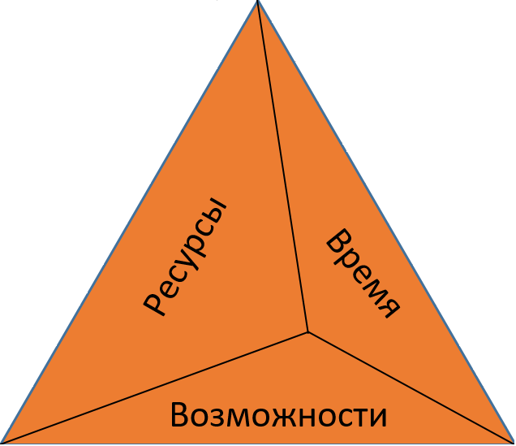
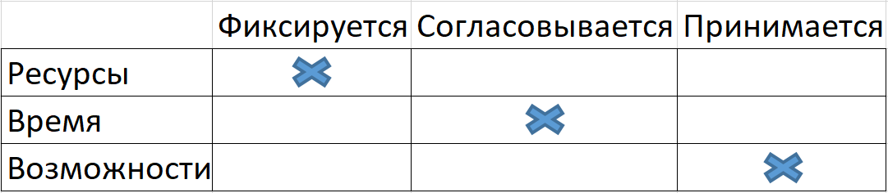
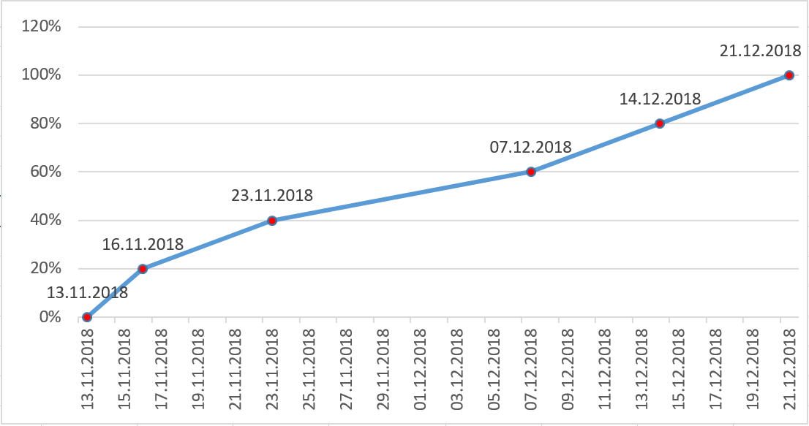



    <h3 align="center"> Федеральное агентство по образованию РФ ГОУ </h3>
    <h3 align="center">ВПО Нижегородский государственный университет им. Н.И.    Лобачевского</h3>
    <h3 align="center">Факультет Вычислительной математики и кибернетики Кафедра Математического обеспечения ЭВМ </h3>
 
 
 
 
 
 
 
 
 
 
    <h3 align="center"> УЧЕБНЫЙ КУРС </h3>
    <h4 align="center">«Объектно-ориентированный анализ и проектирование» для подготовки по направлению «Информационные технологии»</h4>
    <h3 align="center"> СТРУКТУРА ПРОЕКТА </h3>
 
 
 
 
 
 
 
 
 
 
 
 
 
 
    
Нижний Новгород 2018

#
### Содержание
1. __Рамки проекта__
    1. __Матрица компромиссов проекта__
    2. __Вехи проекта__
    3. __Сметы проекта__
    4. __План-график проекта__
2. __Роли и ответственности__
    1. __Знания, умения и навыки__
    2. __Структура команды__
3. __Протоколы проекта__
    1. __Управление конфигурацией__
    2. __Управление изменениями__
    3. __Управление внедрениями__
    4. __Достижение качества проекта__
    5. __Рабочая среда проекта__

<!--
Документ “Структура проекта” включает в себя информацию об организации проектной группы, персонификации ролей и ответственности. Также документ разъясняет схемы взаимодействия проектной группы с заказчиком и заказчика – с проектной группой.
-->
## 1. Рамки проекта
<!--
Рамки (scope) определяют пространство параметров, в котором будет создаваться решение, детализируя функциональность, определяя, что останется за рамками решения и указывая критерии, по которым заинтересованные лица будут судить о готовности решения. Рамки создаются на основе единого видения, являются результатом компромисса между сформулированными целями и условиями реальности и отражают приоритезацию заказчиком имеющихся требований к создаваемому решению. Частью процесса определения рамок проекта является вынесение менее важной функциональности из текущего проекта в планы на будущее.
Рамки проекта (project scope) определяют объем работ, который должен быть выполнен проектной группой для поставки заказчику каждого из элементов, определенного рамками решения.
Управление рамками проекта критично для его успеха. Необходимо определить и фиксировать рамки решения и проекта, используя треугольник компромиссов и матрицу компромиссов проекта.
-->
### 1.1. Матрица компромиссов проекта
<!--
Хорошо известна взаимозависимость между ресурсами проекта (людскими и финансовыми), его календарным графиком (временем) и реализуемыми возможностями (рамками). Эти три переменные образуют треугольник компромисов (tradeoff triangle), показанный на рис. 1.
После достижения равновесия в этом треугольнике изменение на любой из его сторон для поддержания баланса требует модификаций на другой (двух других) сторонах и/или на изначально измененной стороне.

Рисунок 1.	Треугольник компромиссов*
Нахождение верного баланса между ресурсами, временем разработки и возможностями – ключевой момент в построении решения, должным образом отвечающего нуждам заказчика.
-->
Рисунок 1.	Треугольник компромиссов.

<!--
Рисунок 2.	Матрица компромиссов*
Другое весьма полезное средство для управления проектными компромиссами – матрица компромиссов проекта (project tradeoff matrix), показанная на
рис. 2. Она отражает достигнутое на ранних этапах проекта соглашение между проектной группой и заказчиком о выборе приоритетов в возможных в будущем компромиссных решениях. В определенных случаях из этой приоритезации могут делаться исключения, но в целом следование ей облегчает достижение соглашений по спорным вопросам.
Рис. 2 показывает матрицу компромиссов проекта, используемую обычно проектными группами Майкрософт. Она помогает обозначить проектное ограничение, воздействие на которое практически невозможно (колонка “Фиксируется”), фактор, являющийся в проекте приоритетным (колонка “Согласовывается”), и третий параметр, значение которого должно быть принято в соответствии с установленными значениями первых двух величин (колонка “Принимается”).
Принципиально важно наличие у проектной группы и заказчика единого, однозначного взгляда на матрицу компромиссов проекта.
Укажите здесь оценки (в выбранных вами единицах) параметров треугольника компромиссов: ресурсы, которыми располагает ваш проект; имеющееся для реализации проекта время; возможности решения, которые, согласно описанию в документе “Концепция проекта”, будут вами реализованы. Расставьте приоритеты и постройте на их основе матрицу компромиссов.
-->
Рисунок 2.	Матрица компромиссов.

### 1.2. Вехи проекта
<!--
Вехи проекта – это существенные события в жизни проекта. На фазе выработки концепции обычно “выставляются” внешние вехи, которые показывают достижение видимых целей проекта. На самом верхнем уровне в качестве внешних вех могут рассматриваться окончания фаз выполнения проекта. В зависимости от природы проекта вехи могут быть основаны на финансовых затратах, на прогрессе в проекте, на временных интервалах и т.д.
Раннее определение вех позволяет установить точки на временном графике проекта, по которым заинтересованные стороны и проектная группа будут судить о ходе его выполнения.
Выберите и аргументируйте подход к определению вех в вашем проекте. Определите и опишите здесь вехи, на которые вы будете ориентироваться в ходе выполнения проекта.
-->
Для данного проекта будет выбран подход, основанный на временных интервалах. Данный подход был выбран на основе фиксированной даты сдачи работы, а так же присутствия встреч с заказчиком для демонстрации прогресса разработки.
Всего встреч с заказчиком запланировано пять, поэтому вехи будут определены следующим образом:
- с 13.11.2018 до 16.11.2018 - разработка документа "Концепция Проекта".
- 16.11.2018 - демонстрация документа "Концепция Проекта".
- с 16.11.2018 по 23.11.2018 - разработка документов "Структура проекта" и "Функциональная Спецификация".
- 23.11.2018 - демонстрация документов "Структура проекта" и "Функциональная Спецификация".
- с 23.11.2018 по 07.12.2018 - разработка решения и документа "Спецификации и Сценарии Тестов".
- 07.12.2018 - демонстрация решения и документа "Спецификации и Сценарии Тестов".
- с 07.12.2018 по 14.12.2018 -тестирование решения и разработка документа "Тестирование".
- 14.12.2018 - демонстрация результатов тестирования и документа "Тестирование".
- с 14.12.2018 по 21.12.2018 - разработка документа "Постпроектный Анализ".
- 21.12.2018 - демонстрация документа "Постпроектный Анализ".
 
### 1.3. Сметы проекта
<!--
Выполнение проекта предполагает использование ресурсов и подразумевает наличие затрат. Ресурсы включают в себя людей, оборудование, различные расходные материалы и т.д. Затраты рассчитываются на основе тарифов (расценок) на каждый вид требуемого ресурса. В данном разделе должна быть представлена информация о:
 - списке видов ресурсов,
 - требуемом количестве каждого ресурса,
 - тарифе на каждый вид ресурса,
 - общей стоимости каждого ресурса,
 - общей стоимости всех ресурсов, необходимых проектной группе.
На основе информации данного раздела должен рассчитываться бюджет проекта. Также этот этап – хорошая возможность идентифицировать специфические ресурсы, которые могут потребоваться для выполнения проекта.
Укажите, какие виды ресурсов необходимы вашей проектной группе для выполнения проекта, определите в выбранных единицах количество каждого ресурса, оцените общие ожидаемые затраты по ресурсам.
-->
Виды ресурсов:
 
Тестировщик:
- Количество: 1.
- Тариф: 30000 рублей в месяц.
- Общая стоимость: 30000 рублей в месяц.

Разработчик front-end:
- Количество: 1.
- Тариф: 30000 рублей в месяц.
- Общая стоимость: 30000 рублей в месяц.

Разработчик back-end:
- Количество: 1.
- Тариф: 30000 рублей в месяц.
- Общая стоимость: 30000 рублей в месяц.

Инженер проектной документации:
- Количество: 1.
- Тариф: 30000 рублей в месяц.
- Общая стоимость: 30000 рублей в месяц.

Общаяя стоимость всех ресурсов: 120000 рублей в месяц.

### 1.4. План-график проекта
<!--
На этом этапе строится первый вариант графика выполнения проекта на основе выделенных вех и уже сформулированных задач, для каждой из которых задаются даты начала и окончания.
Процесс построения графика проекта итеративен. На фазе выработки концепции график строится на основных вехах проекта. На фазе планирования график становится более детальным в процессе выделения отдельных задач проекта.
На основе выделенных выше вех, а также сформулированных целей и задач определите ожидаемую временную протяженность проекта и постройте предварительный график выполнения проекта.
-->

## 2. Роли и ответственности
<!--
В данном разделе описывается организация проектной группы. Четкие требования к квалификации, ролям и ответственностям членов проектной группы позволяют менеджеру проекта правильно подобрать команду и дают каждому понимание его личного вклада в общий успех проекта.
-->
### 2.1. Знания, умения и навыки
<!--
Участники проектной группы должны удовлетворять определенным требованиям для успешного выполнения проекта. Эти требования выражаются в терминах знаний, умений и навыков и должны включать технические, управленческие и иные возможности.
На основе имеющейся к данному моменту информации о разрабатываемом решении и способе его реализации сформулируйте требования к знаниям, умениям и навыкам, которые необходимы участникам проектной группы. В процессе формулирования учитывайте, что требования должны касаться всех ролевых кластеров команды.
-->
Для каждой роли установлен следующий перечень требований:

Тестировщик:
- Навык командной работы.
- Знание языка программирования C#.
- Умение написание Unit Tests и тестирование программного комплекса.
- Умение работы с GitHub и Git.

Разработчик back-end:
- Навык командной работы.
- Знание языка программирования C#.
- Умение работы с базой данных PostgreSQL.
- Умение разработки и работа с архитектурой "Клиент - Сервер".
- Умение работы с GitHub и Git.

Разработчик front-end:
- Навык командной работы.
- Знание языка программирования C#.
- Умение работы с базой данных PostgreSQL.
- Умение разработки и работа с архитектурой "Клиент - Сервер".
- Умение работы с GitHub и Git.

Инженер программной документации:
- Навык командной работы.
- Умение работы с GitHub и Git.
- Умение разработки программной документации.

### 2.2. Структура команды
<!--
Структура команды определяет организационные единицы (менеджер проекта, спонсоры, лидеры команд, и т.д.), задает отношения между ними и зоны их ответственности.
Распределите роли, в вашей команде и опишите здесь это распределение.
-->
Роли в данном проекте были выбраны совместным переговором между его участниками.
Команда разработчиков:
- Кочин Иван Васильевич - тестирование. Создание удобной среды для параллельной разработки программы, определение процессов взаимодействия, настройка непрерывной интеграции и написание тестов с целью выявления ошибок решения.
- Киселёв Иван Сергеевич - написание back-end. Разработка внутреннего интерфейса приложения, позволяющего выполнять необходимые задачи.
- Землянский Никита Алексеевич - написание front-end. Разработка графического пользовательского интерфейса, использующего функции Backend.
- Максименко Алексей Николаевич - разработка документации. Создание документации, описывающая каждый этап проекта.
На раннем этапе разработки решения в разработке документации принимают все участники команды разработки.
## 3. Протоколы проекта
<!--
Протоколы проекта – это набор описаний процессов в проекте, которые должны быть утверждены, чтобы все участники команды действовали в одинаковом ключе. Стандартизация повышает производительность и облегчает общение как внутри проектной группы так и с заинтересованными сторонами.
-->
### 3.1. Управление конфигурацией
<!--
Многие составляющие решения в процессе работы над проектом претерпевают неоднократные изменения, следовательно, проект нуждается в некоторой стратегии управления конфигурацией, определяющей выбранные методы отслеживания изменений, ведения отчетности и др. Управление конфигурацией должно охватывать проектную документацию, среды разработки и тестирования и любые изменения в проектной среде в целом.
Данный раздел включает:
 - описание методов и средств управления конфигурацией;
 - описание шагов по запросу и принятию изменений в конфигурации;
 - роли и ответственности в управлении конфигурацией;
 - выбор и/или описание требований к системе контроля версий.
Опишите стратегию управления конфигурацией в проекте в соответствии с представленными выше пунктами.
-->
Руководствуясь уровнем сложности проекта и количеством членов команды, было принято решение управлять конфигурацией мануально (вручную). То есть изменение или обновление любой части конфигурации ( будь то система контроля версий, система непрерывной интеграции или же библиотека тестирования ), интегрируются в общую конфигурацию проекта силами членов команды. Однако любое изменение, перед интеграцией в конфигурацию должно быть вынесено на общее обсуждение ( например в виде электронной переписки ), и должно быть одобрено всеми членами команды. Ответственным за сохранение, обновление и изменение конфигурации является член команды, ответственный за инфраструктуру ( конфигурацию ) проекта.

**Требования к системе контроля версий**

- Распределенная ( для ведения параллельной разработки без доступа к интернету ).
- Документированная.
- Имеющая функционал ветвления и слияния веток.
- Имеющая функционал процесса комментирования и одобрения изменений онлайн( далее review процесс ).
- Поддерживаемая ( Документация находится в актуальном состоянии, разработчик системы контроля версий периодически выпускает обновления ).
### 3.2. Управление изменениями
<!--
Одна из существенных идей, лежащих в основе объектно-ориентированного подхода – ориентированность на изменения. В то же время порядок внесения предложений, утверждения и реализации изменений и отслеживания результатов должен быть определен и зафиксирован. Кроме того, все изменения в проекте должны проводиться в соответствии с принятыми и утвержденными рамками решения и рамками проекта. В данном разделе должны быть описаны:
 - процесс управления изменениями;
 - форма запроса на изменение;
 - роли и ответственности в процессе управления изменениями;
 - действия в случае, если предложенные изменения могут отразиться на контракте с заказчиком (в том числе, если эти действия были инициированы самим заказчиком, см. треугольник компромиссов).
Опишите стратегию управления изменениями в проекте в соответствии с представленными выше пунктами.
-->
Процесс управления изменениями будет реализован с помощью использования общей системы контроля версий и процесса review. Любое изменение должно быть оформлено в виде запроса на слияние в главную ветку проекта. Таким образом член команды, предлагающий внести данные изменения, приглашает других членов команды изучить, прокомментировать и одобрить эти изменения. Предполагаемые изменения должны быть одобрены всеми членами команды, после чего слияние с главной веткой проекта разрешается. Главная ветка закрыта для слияния, без оформления специального запроса на изменения. Процесс ревью должны проходить все изменения, независимо от того, какой части проекта они касаются ( код, тесты, конфигурация, документация ).

**Роли:**

- Каждый из членов команды обязан принимать участие в review процессе ( выкладывая свои изменения на обсуждение, и комментируя или одобряя изменения других членов команды ).
- Член команды, ответственный за инфраструктуру, имеет право сливать изменения в главную ветку, если они соответствуют критериям слияния (одобрены всеми членами команды, и прошли автоматическое тестирование ).

### 3.3. Управление внедрениями
<!--
Работа над решением не заканчивается с окончанием этапа разработки. Важным аспектом, требующим внимания, является и процесс внедрения как пилотных так и финальных версий решения. В данном разделе должны быть описаны способы и средства по подготовке релизов и управлению их внедрением, как в тестовые, так и в производственные окружения.
Сформулируйте и опишите здесь мероприятия, необходимые для будущего внедрения решения, которое будет разработано в ходе проекта.
-->
Внедрение, в данном сучае, представляет из себя комплиляцию исходного кода в исполняемый файл приложения, после чего данный файл может быть передан для запуска на системе заказчика. Компиляция исходного кода может производиться как мануально (через формирование необходимого окружения и запуск компилятора в терминале), так и через утилиту CMake, которая будет конфигурировать необходимое окружение и запускать компилятор в этом окружении.

### 3.4. Достижение качества проекта
<!--
Данный раздел описывает, каким образом в ходе выполнения проекта будут удовлетворяться ожидания заказчика и будущих пользователей к качеству создаваемого решения, как с точки зрения разработчиков, так и со стороны управления. Достижение требуемого качества решения должно быть описано через:
 - ожидания к качеству решения;
 - процесс проверки качества;
 - процесс управления достижением качества;
 - роли и ответственности в процессе достижения качества.
Сформулируйте и опишите стратегию по достижению требуемого качества проекта.
-->
Качество проекта будет организовано с помощью покрытия кода юнит-тестами (Unit Testing Framework), обеспечения 80% покрытия кода тестами, и запуском всех тестов на каждый запрос внедрения изменений в главную ветку ( с помощью инструмента непрерывной интеграции качества Travis CI). Так же качество решения гарантируется тем, что любые изменения, перед попаданием в главную ветку проекта проходят процесс review всеми членами команды.

**Критерии качества - изменения могут попасть в главную ветку проекта, только если:**
- Покрытие кода тестами не менее 80%.
- Все юнит тесты выполняются успешно.
- Изменения одобрены всеми членами команды.

Отвественный за соблюдение всех требований, влияющих на качество проекта - член команды, отвечающий за  тестирование.

### 3.5. Рабочая среда проекта
<!--
В данном разделе должен быть описан подход к созданию рабочей среды проекта, определяющий как организационные требования (размещение членов команды, комнаты для митингов и т.д.), так и требования к оборудованию (компьютеры, столы, телефоны и т.д.). Здесь же должны определяться требования к инструментам и системам, таким как системы контроля версий, среды разработки, инструменты тестирования и др.
Сформулируйте и опишите требования к рабочей среде проекта.
-->
Так как процесс разработки является параллельным и удаленным, команда не имеет каких-либо организационных требований, так как не имеет централизованного рабочего места. Таким образом, далее, будут перечислены только требования к програмному обеспечению:

- **Среда разработки - Visual Studio 2010,2012,2013,2015,2017**

Удобная, развивающаяся, мощная, имеющая встроенный современный компилятор IDE, разрабатываемая компанией Microsoft (создатели C#), отлично подходит для разработки, компиляции, сборки, отладки и тестирования продуктов на C#. При условии открытия исходного кода приложения, разрешается использовать для разработки бесплатную Community версию. Выбран по вышеописанным причинам, а так же по наличию опыта работы с этим инструментом у каждого члена команды.

- **Система контроля версий - Git, Git Hosting - GitHub**

**Git** - Самая популярная в мире, удобная, распределенная система контроля версий, распространяемая под лицензией GNU GPL 2.0 (разрешено использовать программу в комерческих целях). Выбран по вышеописанным причинам, а так же по наличию опыта работы с этим инструментом у каждого члена команды.

**GitHub** - Крупнейший Git Hosting с широким набором функций, поддержкой CodeCoverage( покрытие кода ), CI( непрерывная интеграция ) и предоставляемым web API, поддерживаемый компанией Microsoft. Выбран по вышеописанным причинам, а так же по наличию опыта работы с этим инструментом у каждого члена команды.

- **Unit Tests Framework - Unit Testing Framework**

Стандартный C# Unit Tests Framework, очень удобная поддержка, создание, и отладка, при использовании Visual Studio. Выбран, так как является стандартным инструментом, для используемого командой IDE.

- **Программа для реализации непрерывной интеграции - Travis CI**

Удобный, бесплатный сервис, предоставляющий интерфейс для запуск широкого спектра тестов на удаленных серверах. Ключевыми факторами выбора этого инструмента была интеграция в GitHub репозиторий и простота освоения.

- **Другие инструменты**

Всем членам команды разрешается пользоваться любыми другими инструментами, использование которых разрешено в коммерческих целях.
