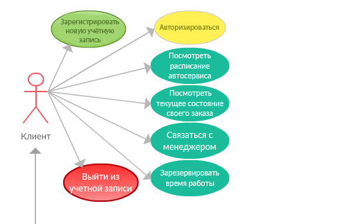

    <h3 align="center"> Федеральное агентство по образованию РФ ГОУ </h3>
    <h3 align="center">ВПО Нижегородский государственный университет им. Н.И.    Лобачевского</h3>
    <h3 align="center">Факультет Вычислительной математики и кибернетики Кафедра Математического обеспечения ЭВМ </h3>
 
 
 
 
 
 
 
 
 
 
    <h3 align="center"> УЧЕБНЫЙ КУРС </h3>
    <h4 align="center">«Объектно-ориентированный анализ и проектирование» для подготовки по направлению «Информационные технологии»</h4>
    <h3 align="center"> ФУНКЦИОНАЛЬНАЯ СПЕЦИФИКАЦИЯ </h3>
 
 
 
 
 
 
 
 
 
 
 
 
 
 
    
Нижний Новгород 2018

#
### Содержание
1. __История проекта__
2. __Цели дизайна__
    1. __Требования пользователя__
    2. __Системные требования__
    3. __Сценарии использования__
3. __Исключенные возможности и неподдерживаемые сценарии__
4. __Предположения и зависимости__
5. __Проект решения__
    1. __Концептуальный проект__
    2. __Логический проект__
    3. __Физический проект__
6. __Требования к инсталляции и деинсталляции__

## 1. История проекта
<!--
Раздел «История проекта» перечисляет ключевые события в процессе создания решения в хронологической последовательности, так, как их видит команда. Перечисляются важные принятые решения. Данная информация может оказаться полезной для оценки того, почему проект был успешным (или, напротив, провальным) и почему. Подобный анализ будет крайне полезен при создании подобных решений в будущем.
Приведите здесь основные события и важные решения в процессе реализации проекта.
-->
## 2. Цели дизайна
<!--
Данный раздел документа обобщает выполненный ранее анализ требований. Формулируются требования с точки зрения заказчика, пользователей, аппаратного и программного окружения. Данные требования, сформулированные ранее в общем виде, должны быть скорректированы в требования к решению и его отдельным компонентам в терминах команды разработчиков. В результате происходит уточнение целей проекта, сформулированных ранее в видении/рамках.
-->
### 2.1. Требования пользователя
<!--
Раздел «Требование пользователя» перечисляет выявленные требования к решению с точки зрения заказчика и конечных пользователей.
Приведите здесь требования заказчика и конечных пользователей.
-->
#### Требования заказчика:
* Разрабатываемая система должна быть надёжной. Надёжность обеспечивается путём аккаунтов с разным уровнем доступа.
* Система должна упростить работу с клиентами автосервиса. Возможность связаться с клиентом в любое удобное время.
* Система должна обеспечивать работу нескольких пользователей одновременно.
* Необходима возможность нанимать и увольнять персонал.
* Простой интерфейс.
* Необходим один аккаунт-управляющий.
* Быстрая и не затратная разработка.

#### Требования пользователей:
##### Клиент.
* Просматривать график занятости автосервиса онлайн.
* Выбор наиболее удобной даты и времени из доступных.
* Простота интерфейса.
* Просмотр текущего состояния работы за пару кликов.
* Быстрая связь с менеджером.

##### Менеджер.
* Быстрая связь с клиентами.
* Отображение всех своих клиентов.
* Изменение статуса работ за несколько кликов.
* Быстрый перенос времени на другое незанятое.
* Возможность использовать функционал клиента для собственного автомобиля.

##### Администратор.
* Отображение всех заказов автосервиса.
* Отображение всех пользователей автосервиса.
* Возможность быстро нанять или уволить персонал.
* Сменить менеджера для определённого клиента.
* Возможность использовать функционал клиента для собственного автомобиля.

### 2.2. Системные требования
<!--
Сформулируйте здесь требования к аппаратному и программному окружению.
-->
#### Общие
* Компания Починим все должна предоставить ПК для Базы Данных и взаимодействия с пользователями через сеть Интернет.
* ПК должен иметь минимум 4-х ядерный процессор и иметь доступ в сеть со скоростью не менее 32 Мбит/с.
* Система будет работать сразу с несколькими пользователями одновременно.
#### Необходимое ПО
* Данная система предназначена для операционных систем Windows 7 и Windows 10.
* Для использования приложения устройства пользователей должны иметь доступ в сеть как минимум со скоростью 256 кб/с.

<!-- Здесь могли быть ваши системные требования -->

### 2.3. Сценарии использования
<!--
Приведите диаграмму вариантов использования. Прокомментируйте диаграмму. Перечислите варианты использования, опишите их суть. Для вариантов использования укажите сценарии. Для написания данного раздела рекомендуется язык UML.
-->

##### Клиент.
* Регистрация.
Позволяет пользователю зарегистрировать новый аккаунт. Для этого необходимо будет ввести незарегистрированный ранее email и придумать пароль к аккаунту. После прохождения регистрации пользователь сможет войти в систему используя указанный ранее email + пароль.

* Авторизация.
Если пользователю уже принадлежит какой-либо аккаунт, он сможет используя email и пароль войти в систему. После прохождения авторизации ему будут доступны разрешённые возможности приложения. Авторизированные пользователи не могут авторизироваться ещё раз.

* Просмотр расписания автосервиса.
Авторизированным пользователям будет доступно расписание текущих работ автосервиса. Расписание будет представлять собой календарь показывающий все будущие работы на две недели вперёд.

* Зарезервировать время работы.
Пользователь сможет выбрать удобное для него, незанятое время работы мастера. Незанятое время будет отображаться в расписании. Потзователь может закрепить выбранное время работы за собой. После выбора времени и его подтвержения, оно будет отображаться в расписании как занятое.

* Посмотреть текущее состояние заказа.
Если пользователь уже зарезервировал для себя время работы или работа уже начата, то он сможет узнать текущее состояние работы. Для этого будет отдельная вкладка в приложении. При нажатии на экран будет выведена вся актуальная, на данный момент информация.

* Связаться с менеджером.
Позволяет пользователю связаться с работником, отвечающим за работу с автомобилем пользователя. Будет открыт чат, в который можно будет задать все интересующие вопросы.

* Выход из системы.
Данная функция позволит авторизированному пользователю выйти из своего аккаунта. После выхода ему вновь станет доступна авторизация.

##### Менеджер.
* Менеджер может так же использовать все возможности клиента.

* Открыть список администрируемых заказов.
Открыть список клиентов, за работу над автомобилями которых отвечает текущий менеджер.

* Выбрать заказ.
Из списка, который описан выше, будет возможно открыть любую запись и увидеть более подробную информацию об заказе.

* Изменить время работы
Менеджер для определённого заказа, закреплённого за ним, будет иметь возможность изменить время записи клиента в автосервис. Менеджеру будут предложены все возможные свободные места в расписании автосервиса.

* Изменить статус работы
Менеджер для определённого заказа, закреплённого за ним, будет иметь возможность изменить статус. Статус представляет короткую информацию о заказе. Например "Ожидается диагностика" или "Детали заказаны. Ожидается получение". Изменение данного статуса будет видно клиенту.

* Связаться с клиентом
Менеджер будет иметь возможность связаться с клиентом с помощью встроенного в приложение чата. С помощью него будет возможность уточнения некоторых деталей работы связанной с автомобилем.

##### Администратор.
* Администратор может так же использовать все возможности клиента.

* Открыть список всех заказов автосервиса.
Администратор будет иметь доступ ко всем заказам автосервиса. Таким образом он сможет получить и просмотреть информацию о любом заказе в автосервисе.

* Переназначить менеджера.
Администратор будет иметь возможность для любого заказа изменить курирующего менеджера на любого другого менеджера, зарегистрированного в системе.

* Открыть список зарегистрированных пользователей.
Администратор будет иметь доступ к полному списков всех зарегистрированных полльзователей. В любой момент времени он сможет окрыть этот список.

* Назначить пользователя менеджером.
Любого пользователя из списка зарегистрированнх Администратор сможет "нанять" на работу. Нанятый пользователь получает статус менеджер и может использовать весь функционал открытый для менеджеров.

* Снять пользователя с должности менеджера.
Пользователя со статусом менеджер Администратор сможет "уволить". Таким образом данный пользователь теряет возможность использовать функционал менеджера.

## 3. Исключенные возможности и неподдерживаемые сценарии
<!--
В данном разделе предполагается указание требований, которые не найдут отражение в текущем релизе проекта. При этом должны быть указаны как требования пользователей, требования к аппаратному и программному окружению. Для каждого из требований, которые не планируется удовлетворять, необходимо привести обоснование (почему это не делается). В данной секции можно сформулировать соображения относительно того, что необходимо сделать в будущих релизах, чтобы удовлетворить требованиям, и когда (и в каком случае) это может быть сделано.
Необходимо дополнительно отметить важность данного раздела. В любом случае важно честно сформулировать, какую функциональность мы создаем. Необходимо всеми силами избегать непонимания сторонами того, о чем конкретно они договорились. Соображения вида «сейчас все ОК, а там будет видно» на практике приводят к катастрофам на завершающих этапах.
Укажите здесь исключенные возможности и неподдерживаемые сценарии.
-->

### Пользователи
#### Общие
* Не будет возможности удалить аккаунт, как у клиента, так и у администратора. Это обусловлено тем, что в начале работы сервиса не будет большого числа "неактивных" аккаунтов. Соответственно для первой версии эта функция не является необходимой. Так же это может потребовать дополнительное финансирование.
* Не будет сбора какой-либо статистики. Такой как число постоянных клиентов у определённого менеджера. Число клиентов конкретного менеджера, общее число клиентов за отрезок времени и тд. На первых этапах внедрения системы эта информация будет не актуальной, в последующих версиях её можно будет добавить.
* Планируется только один аккаунт админа. Пароль и логин от него будут у заказчика. Он может сам заниматься администрированием или выдать логин пароль доверенному лицу. На данный момент пока число работников автосалона не столь велико, с такой задачей может справится и один администратор. Изменение этого условия потребует дополнительных трат, так как необходимо учитывать многие аспекты. Например создание аккаунта главного админа, который присваивает и отнимает у других права администрирования.
* Не будет реализована возможность восстановление забытого или потерянного пароля. Для реализации необходима проверка личности, необходимы серьёзные изменения в системе безопасности.
* Не будет реализованна возможность запоминания пароля от аккаунта на одном ПК. Это необходимо для безопасности системы.
##### Клиент
* Нет возможности зарегистрировать несколько машин для одного аккаунта. Для реализации необходимо время и доп. финансирование.
* Не будет реализована система оповещения по электронной почте или иными способами. Для реализации необходимо время и доп. финансирование. Возможна реализация в дальнейших версиях.
##### Менеджер 
* Менеджер не сможет самостоятельно снять с себя обязанности менеджера. Работодатель должен оставлять за собой возможность "последнего слова".
* Менеджер не сможет связаться с другими менеджерами или администратором через приложение. В приложении нет возможности связываться с другими пользователями, только непосредственно со своим клиентом(менеджером). Для реализации понадобятся дополнительные траты на содержание и обслуживание большого объема данных.
##### Администратор
* Не будет возможности создавать новые аккаунты администраторов. Необходимо продумать некоторые условия, часть которых описана выше.
* Не будет возможности удалить аккаунт клиента. Причины описаны выше.

#### Аппаратное обеспечение и ПО
* Не будет реализован бекап ( возможность восстановить систему при её сбое ) системы. Потребуются существенные денежные траты на создание резервной копии базы данных.
* Система будет разработана только для операциооной системы Windows. Портирование на другие операционные системы вынудит учитывать спецификации этих операционных систем.
* Программу необходимо будет устанавливать на ПК для дальнейшего использования. У системы не предусмотрена онлайн( браузерная версия ). Иначе была бы необходимость полного перестроения проекта.
* Заказчик должен самостоятельно позаботится о необходимо сильном ПК для хранения базы данных и достаточной скорости сети доступа к ней.
## 4. Предположения и зависимости
<!--
Раздел «Предположения и зависимости» перечисляет и определяет предположения и зависимости, ориентированные на проект и сделанные в рамках создания функциональной спецификации.
Укажите здесь предположения и зависимости.
-->

Что здесь писать?

## 5.	Проект решения
<!--
Проект решения обобщает документы, созданные в рамках проектирования будущего решения, в краткой сжатой форме. При этом указываются назначение и важность для проекта указанных документов. Эта информация способствует
выработки у читателя ясного представления о концепции проектирования решения.
-->
### 5.1. Концептуальный проект
<!--
Концептуальный проект – стратегический документ, содержащий информацию о том, как решение будет реализовывать рассмотренные ранее сценарии вариантов использования. Сценарии описывают всех пользователей решения, а также их возможные действия. Данный раздел содержит проект системы в терминах пользователя на основе имеющейся диаграммы вариантов использования и сценариев вариантов использования.
Данный раздел должен быть кратким. В противном случае, он будет трудным для понимания, что существенно снизит его полезность. Необходимо обратить особое внимание на то, что часть читателей данного раздела не владеет технической терминологией и знаниями. Поэтому важно сформулировать положения дизайна, по возможности не привлекая специальной терминологии.
Применение визуальных средств (UML) может существенно упростить понимание и всячески приветствуется.
Приведите здесь концептуальный проект решения (архитектура решения, важные проектные решения, возможные варианты, их плюсы и минусы) в терминах, понятных заказчику.
-->
### 5.2. Логический проект
<!--
Создание логического проекта – следующая стадия в проектировании решения. Так, в концептуальном проекте мы показываем будущее решение в терминах заказчика, не привлекая технологии и ничего не говоря о внутреннем устройстве. В логическом проекте мы должны выделить основные структурные элементы будущего решения, разобраться с их иерархией, поведением, атрибутами, взаимосвязями.
В результате логического проектирования мы должны получить абстрактную модель решения. При этом речь о привлечении каких-то технологий реализации данной модели пока не идет.
На этапе логического проектирования могут быть решены следующие важные задачи:
1) Сбор откликов заинтересованных лиц. При этом мы можем обнаружить ошибки проектирования на ранней стадии.
2) Проверка соответствия проекта требованиям.
3) Создание базиса для последующей разработки системы тестов.
Приведите здесь логический проект решения (объекты , атрибуты, поведение, связи). Активно используйте нотацию UML.
-->
### 5.3. Физический проект
<!--
Физический проект представляет собой проекцию логического проекта на имеющееся аппаратное, программное и технологическое окружение. Так, нам надлежит выбрать те или иные технологии для реализации идей, заложенных в концептуальном и уточненных в логическом дизайне.
Физический проект фактически представляет собой документацию с четким указанием параметров реализуемой функциональности в терминах разработчиков программного обеспечения.
Кроме того, решаются как вопросы создания компонентов, допускающих повторное использование, так и вопросы применения написанного ранее кода (или сторонних разроботок).
Приведите здесь физический проект решения.
-->
## 6. Требования к инсталляции и деинсталляции
<!--
Приведите здесь информацию по тому, как будет осуществляться инсталляция/деинсталляция решения. Сформулируйте требования к этим процессам.
-->
